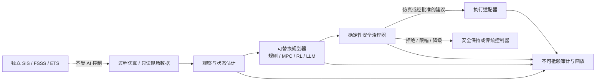

# Agentic DCS Lab｜燃煤机组智能控制参考实验室

[English](README.en.md) · [架构](docs/architecture.md) · [安全论证](docs/safety-case.md) · [路线图](ROADMAP.md)

> **研究软件，不可用于生产控制。** 本项目的代码和示例没有经过任何机组、SIL、型式或法规认证；不得连接真实 DCS 写通道，不得替代 BMS/FSSS、ETS、SIS、机械超速保护或人工紧急停机能力。

Agentic DCS Lab 是一个**仿真优先、可审计、安全层独立**的开源参考框架，用来研究 AI 智能体与可验证工作流如何逐步承担燃煤电厂的协调控制、运行优化、异常处置建议和组态生成等任务。

项目的长期问题不是“让一个大模型直接操纵阀门”，而是：能否把传统 DCS 中可迁移的控制意图表达为开放、可测试、可回放、可批准、可降级的智能工作流，同时让毫秒级基础闭环和独立保护层继续由确定性系统负责。

## 当前能做什么

- 运行一个简化锅炉—汽轮机教学模型；
- 演示 `观察 → 计划 → 安全裁决 → 执行 → 审计` 工作流；
- 对所有执行量实施硬限值与变化率限制；
- 在规划器异常时自动保持上一安全输出并留下审计记录；
- 为未来接入 MPC、强化学习、LLM、数字孪生和 OPC UA 只读数据提供稳定接口。

## 明确不做什么

- 不宣称当前版本能够替换真实 DCS；
- 不允许 AI 绕过联锁、保护和许可条件；
- 不把非确定性模型放入毫秒级控制闭环；
- 不提供开箱即用的真实设备写适配器；
- 不接受含电厂敏感点表、凭据、网络拓扑或专有组态的公开提交。

## 架构原则



项目采用四级部署成熟度：`simulation`（仿真）、`shadow`（影子）、`advisory`（建议）、`controlled_write`（受控写入）。仓库默认且目前只支持 `simulation`；任何升级都必须经过现场危害分析、独立验证、管理审批和回退演练。

## 五分钟运行

需要 Python 3.11+：

```bash
python -m venv .venv
# Linux/macOS: source .venv/bin/activate
# Windows PowerShell: .venv\Scripts\Activate.ps1
python -m pip install -e .
agentic-dcs --steps 300 --target-load 300
```

故障注入：

```bash
agentic-dcs --steps 60 --fail-planner-at 20 --audit artifacts/audit.jsonl
```

测试：

```bash
python -m pip install ruff
python -m unittest discover -s tests
ruff check .
```

## 仓库地图

```text
src/agentic_dcs/   核心模型、代理、安全治理、运行时和审计
tests/             安全不变量与故障降级测试
config/            场景与只读部署配置
examples/          最小示例
docs/              架构、安全论证、集成与威胁模型
.github/           CI、Issue/PR 模板
```

## 如何参与

最有价值的早期贡献包括：匿名化的典型运行场景、可公开的简化机理模型、安全不变量、组态中间表示、回放数据规范、控制算法基准和故障注入案例。请先阅读 [CONTRIBUTING.md](CONTRIBUTING.md) 与 [SECURITY.md](SECURITY.md)。

## 标准与参考边界

本项目以 NIST SP 800-82 的 OT 安全原则、ISA/IEC 61511 的安全生命周期思想、NIST AI RMF 的治理方法和 OPC UA 安全模型为参考；“参考”不等于认证或合规。正式部署必须由具备资质的业主、设计院、设备厂家及功能安全/网络安全团队依据所在地法规和现场安全生命周期完成独立评估。

## 许可证

Apache License 2.0。详见 [LICENSE](LICENSE)。

