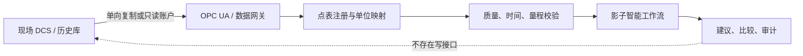

# 真实 DCS 数据接入

本模块的第一目标是用现场真实测点验证智能工作流，而不是取得控制权。接入顺序固定为：历史导出文件、隔离区历史库副本、OPC UA 只读网关、实时影子运行。禁止从企业网或研究环境反向建立到控制器的写路径。

## 数据通路



`config/real-points.example.json` 是供应商无关的点表模板。示例地址必须替换为现场经过批准的 OPC UA NodeId；真实点名、IP、证书、账号和网络拓扑不得提交到公开仓库。

每个点至少声明：

- 稳定的规范键和现场源地址；
- 工程单位及可信量程；
- 最大数据龄期；
- 是否为必需点；
- `writable: false`。

当前规范测点用于组装 `Measurement`：机组负荷、主汽压力、汽包水位、烟气含氧量，以及燃料、给水、风量和调门的当前指令反馈。现场接入必须明确一次值、校正值、指令值和反馈值的语义，不能只凭相似点名映射。

## OPC UA 约束

`OpcUaReadOnlyAdapter` 是能力受限的边界：它只有批量读取方法，没有写入、方法调用或节点管理方法。策略强制：

- `opc.tcp` 端点白名单；
- `SignAndEncrypt`；
- 禁止匿名身份；
- 应用证书和用户身份分离；
- 现场证书、私钥和口令由站点密钥设施管理；
- 在隔离研究环境中记录连接、质量变化、丢帧和配置版本。

生产适配器应使用经过现场验证的 OPC UA SDK 实现 `ReadOnlyUaClient`，并把每个值、服务器状态码映射后的质量及源时间戳一起返回；不得在客户端无条件生成“良好”质量。适配器应通过网关或 DMZ 部署。核心包不替站点选择证书策略、信任链、账户权限或网络路径。

OPC UA 的 MonitoredItem/Subscription 适合实时数据，但订阅恢复能力不能代替历史库：长时中断、服务端重启、队列溢出和时钟偏差都必须被显式检测。

## 历史回放

仓库使用长表 CSV：

```text
timestamp_s,key,value,quality
1000,load_mw,295.0,good
```

运行示例：

```bash
python examples/run_shadow_replay.py
```

真实数据公开前必须去除设备标识、绝对时间、班组信息、报警文本、网络信息和可能推断商业运行状态的数据。优先发布合成或经过业主书面批准的数据集。

## 从影子到替代的准入门槛

1. **历史回放**：覆盖启停、变负荷、磨煤机切换、AGC 扰动及传感器/通信故障。
2. **实时影子**：连续运行但无执行能力，量化建议与 DCS/操作员动作的差异。
3. **建议模式**：独立界面、人工确认、明确置信度和失效状态。
4. **受限闭环**：仅针对低风险、可逆、慢时间尺度的单一功能；确定性许可、限幅、看门狗和无扰切回必须独立于 AI。
5. **功能替代**：逐回路、逐工况证明等效或更安全，而非一次性替换整套 DCS。

进入下一阶段前需要现场危害分析、控制逻辑基线、网络安全评审、模型验证报告、误动作与漏动作指标、操作员培训、管理变更和回退演练。仓库测试不能代替这些证据。
